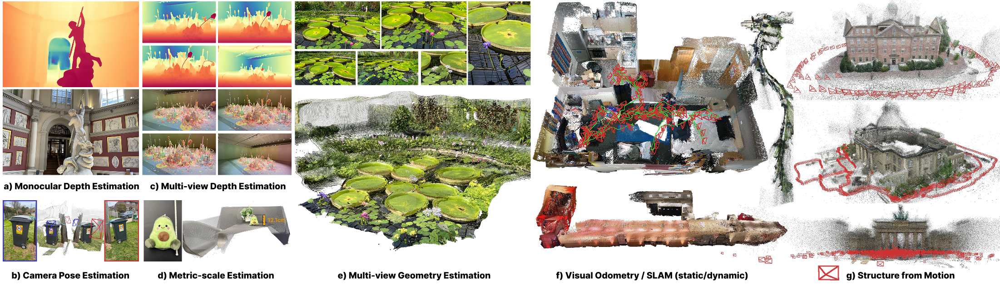

<h1 align="center">AMB3R: Accurate Feed-forward Metric-scale<br>3D Reconstruction with Backend</h1>


<div align="center">

### [Paper](https://arxiv.org/abs/2511.20343) | [Project Page](https://hengyiwang.github.io/projects/amber) 

<a href="#installation">Installation</a> | <a href="#amb3r-base-model">Base Model</a> | <a href="#slam-amb3r-vo">SLAM</a> | <a href="#sfm-amb3r-sfm">SfM</a> | <a href="#benchmark">Benchmark</a> | <a href="#training">Training</a>

</div>

<p align="center">
  <a href="">

  </a>
</p>

```bibtex
@article{wang2025amb3r,
  title={AMB3R: Accurate Feed-forward Metric-scale 3D Reconstruction with Backend},
  author={Wang, Hengyi and Agapito, Lourdes},
  journal={arXiv preprint arXiv:2511.20343},
  year={2025}
}
```

## 📌 Latest Updates
- **[2026-03-09]** Add training code for [AMB3R](docs/train.md).
- **[2026-03-02]** Add DepthAnything 3 for [benchmark](benchmark/README.md) and support [**AMB3R-VO (DA3)**](benchmark/README.md)
- **[2026-02-28]** 📊 We have officially released the code for **AMB3R Benchmark**.
- **[2026-02-24]** 🗺️ We have officially released the code for **AMB3R-SfM**.
- **[2026-02-21]** 🏎️ We have officially released the code for **AMB3R-VO**.
- **[2026-02-21]** 🍯 We have officially released the code for **AMB3R (Base model)**.

<details>
<summary><b>🔜 TODOs / Upcoming</b></summary>

- [ ] visualizer for AMB3R
- [ ] support of various foundation models for AMB3R-VO and AMB3R-SfM

</details>

<a id="installation"></a>

## Installation

**1. Clone the repository**

```bash
git clone https://github.com/HengyiWang/amb3r.git
cd amb3r
```

**2. Create a Conda environment**

```bash
conda create -n amb3r python=3.9 cmake=3.14.0 -y
conda activate amb3r 
pip install torch==2.5.0 torchvision==0.20.0 torchaudio==2.5.0 --index-url https://download.pytorch.org/whl/cu118
pip install torch-scatter==2.1.2 -f https://data.pyg.org/whl/torch-2.5.0+cu118.html
pip install "git+https://github.com/facebookresearch/pytorch3d.git@V0.7.8" --no-build-isolation

pip install flash-attn==2.7.3 --no-build-isolation
   
pip install -r requirements.txt
```

**3. Download weights**

Download our [checkpoint](https://drive.google.com/file/d/14x0WW2rUE_he2hUEouP6ywSRnlJDeLel/view?usp=sharing) and place it under `./checkpoints/`.

---

<a id="amb3r-base-model"></a>
## 🍯 AMB3R (Base model)

### Usage

Run the interactive demo with the following command:

```bash
python demo.py 
```

**Controls:**

- **`0` / `1`** : Disable (w/o) / Enable (w/) backend
- **`↓` / `↑`** : Decrease / Increase confidence threshold by `0.01`
- **`←` / `→`** : Decrease / Increase confidence threshold by `0.1`
- **`E`** : Enable sky & edge mask
- **`B`** : Switch background color

---

<a id="slam-amb3r-vo"></a>
## 🏎️ SLAM (AMB3R-VO)

### Usage

Run the AMB3R-VO pipeline with:

```bash
python slam/run.py --data_path <path-to-video-folder>
```

### Custom Base Model

Our AMB3R-VO framework is a general framework that is compatible with any base model that produces pointmap, camera pose, and confidence. All you need to do is to add this function to your base model and plug it into our amb3r-vo pipeline `pipeline = AMB3R_VO(model)`:

```python
def run_amb3r_vo(self, frames, cfg, keyframe_memory=None):
    """
    This function runs the AMB3R-VO  with your own base model.
    """
    images = frames['images'] # (B, T, C, H, W) in [-1, 1]
    
    # Run your own base model to get pointmap, pose, and confidence
    pointmap, pose, confidence = self.forward(images)

    return {
        'world_points': pointmap,           # (B, nimgs, H, W, 3)
        'world_points_conf': confidence,    # (B, nimgs, H, W, 1)
        'pose': pose,                       # (B, nimgs, 4, 4)
    }
```

---

<a id="sfm-amb3r-sfm"></a>
## 🗺️ SfM (AMB3R-SfM)

### Usage

Run the AMB3R-SfM pipeline with:

```bash
python sfm/run.py --data_path <path-to-video-folder>
```

### Custom Base Model

Our AMB3R-SfM framework is also a general framework that is compatible with any base model that produces pointmap, camera pose, and confidence. All you need to do is to add this function to your base model and plug it into our amb3r-sfm pipeline `pipeline = AMB3R_SfM(model)`:

```python
def run_amb3r_sfm(self, frames, cfg, keyframe_memory=None, benchmark_conf0=None):
    """
    This function runs the AMB3R-SfM  with your own base model.
    """
    images = frames['images'] # (B, T, C, H, W) in [-1, 1]
    
    # Run your own base model to get pointmap, pose, and confidence
    pointmap, pose, confidence = self.forward(images)

    return {
        'world_points': pointmap,           # (B, nimgs, H, W, 3)
        'world_points_conf': confidence,    # (B, nimgs, H, W, 1)
        'pose': pose,                       # (B, nimgs, 4, 4)
    }
```

---

<a id="benchmark"></a>
## 📊 Benchmark

Please refer to [benchmark/README.md](benchmark/README.md) for the benchmark details.

---

<a id="training"></a>
## 🎓 Training

Please refer to [docs/train.md](docs/train.md) for the training details.

---

## Acknowledgement 

Our code, data preprocessing pipeline, and evaluation scripts are built upon several amazing open-source projects:

- **Models:** [VGGT](https://github.com/facebookresearch/vggt), [Pointcept](https://github.com/Pointcept/Pointcept), [Spann3R](https://github.com/HengyiWang/spann3r), [DUSt3R](https://github.com/naver/dust3r), [MoGe](https://github.com/microsoft/MoGe), [CroCo](https://github.com/naver/croco)
- **Evaluation:** [Marigold](https://github.com/prs-eth/Marigold), [Diffusion-E2E](https://github.com/VisualComputingInstitute/diffusion-e2e-ft), [RMVD](https://github.com/lmb-freiburg/robustmvd), [MVSA](https://github.com/nianticlabs/mvsanywhere), [visloc_pseudo_gt](https://github.com/tsattler/visloc_pseudo_gt_limitations), [FVS](https://github.com/isl-org/FreeViewSynthesis)

We sincerely thank the authors for their open-source contributions!

The research presented here has been supported by a sponsored research award from Cisco Research and the UCL Centre for Doctoral Training in Foundational AI under UKRI grant number EP/S021566/1. This project made use of time on computing resources from <a href="https://www.genai.ac.uk/">UKRI/EPSRC AI Hub in Generative Models</a> [grant number EP/Y028805/1]. 

---

## Citation

If you find our code, data, or paper useful, please consider citing:

```bibtex
@article{wang2025amb3r,
  title={AMB3R: Accurate Feed-forward Metric-scale 3D Reconstruction with Backend},
  author={Wang, Hengyi and Agapito, Lourdes},
  journal={arXiv preprint arXiv:2511.20343},
  year={2025}
}
```
